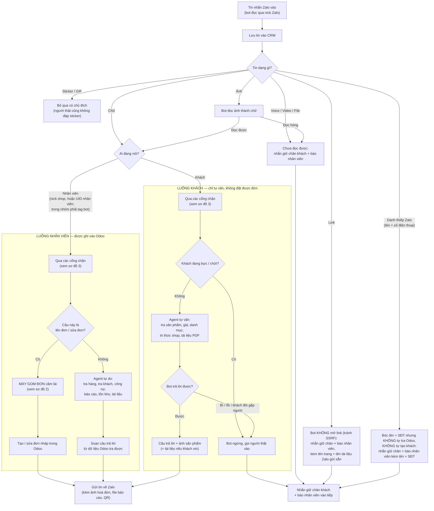
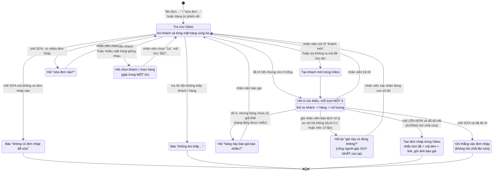
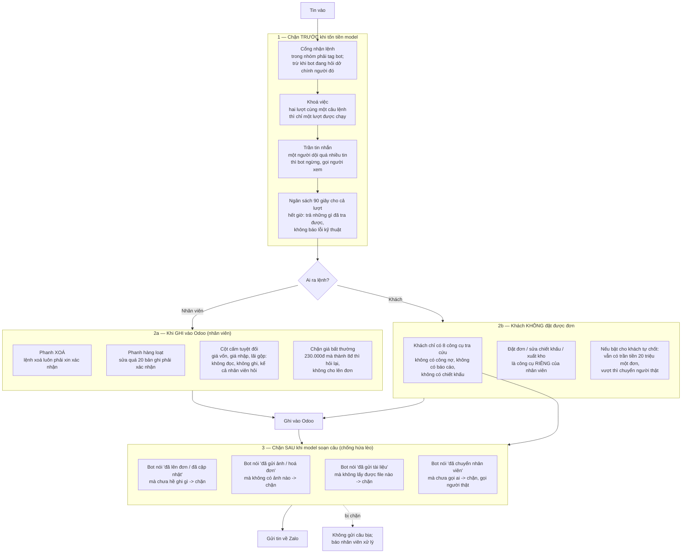
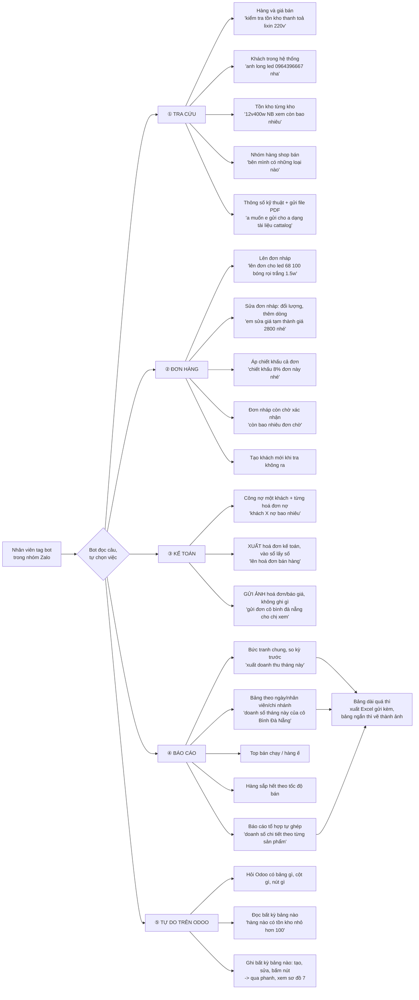
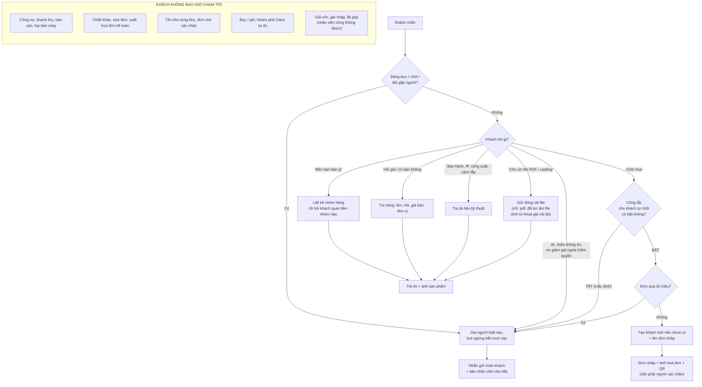
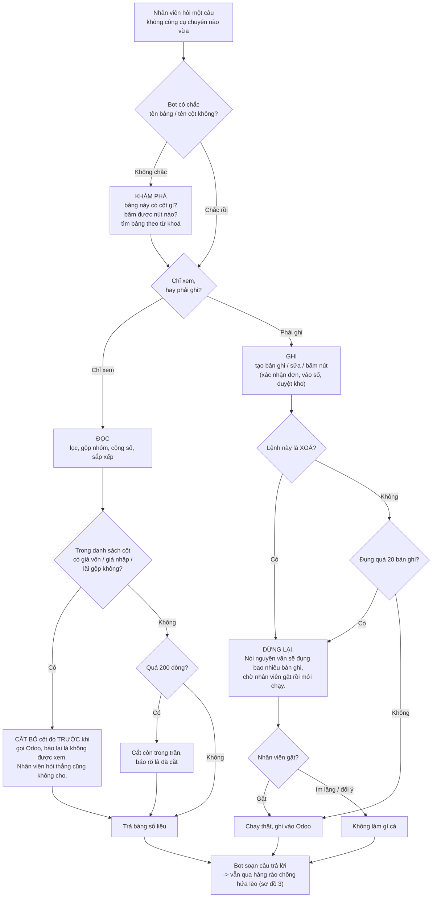
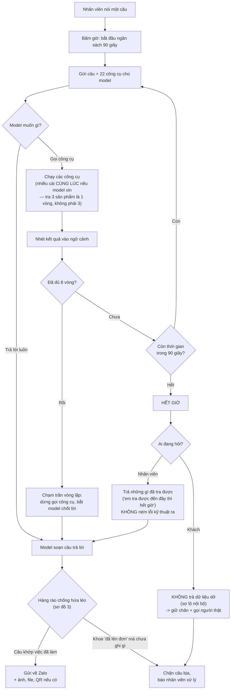

# Sơ đồ luồng bot Zalo

> **Sơ đồ này VIẾT TAY, không tự sinh từ code.** Sửa luồng xử lý thì phải sửa
> sơ đồ kèm trong cùng commit — sơ đồ lạc hậu còn hại hơn không có sơ đồ.
> **Cập nhật lần cuối: 11/08/2026.**

Viết cho người vận hành đọc: mọi thứ trong sơ đồ là ngôn ngữ nghiệp vụ, không
phải tên file. Tên file chỉ nằm ở chú thích cuối mỗi sơ đồ, để lập trình viên
lần ra chỗ sửa. Chi tiết kỹ thuật + lịch sử bug: `docs/KIEN-TRUC-AGENT.md`.

**Đọc cái nào trước:** muốn nắm toàn cảnh trong 5 phút thì đọc sơ đồ 1 rồi
nhảy sang sơ đồ 5. Bốn sơ đồ đầu tả **cơ chế** (tin đi đường nào, hàng rào
nào chặn); bốn sơ đồ sau tả **nghiệp vụ** (bot làm được những việc gì cho ai).

| # | Sơ đồ | Trả lời câu hỏi |
|---|---|---|
| 1 | Tổng quan | Một tin Zalo vào thì đi đâu, ai xử, trả lời kiểu gì |
| 2 | Máy gom đơn | Đang lên đơn thì bot hỏi gì tiếp theo, vì sao hỏi vậy |
| 3 | Các cổng chặn | Hàng rào nào chặn cái gì, chặn ở thời điểm nào |
| 4 | Ba lớp chống trả lời trùng | Vì sao có tận ba lớp, gộp lại được không |
| 5 | Bản đồ nghiệp vụ nhân viên | Nhân viên nhờ được bot làm những việc gì (22 việc) |
| 6 | Luồng khách chi tiết | Khách được hỏi gì, bị chặn gì, khi nào gọi người thật |
| 7 | Ba công cụ Odoo tổng quát | Phần quyền lực nhất — bot đụng được gì, phanh ở đâu |
| 8 | Vòng đời một lượt | Vì sao có câu trả lời 2 giây, có câu 60 giây |
| — | Phụ lục | Công cụ đăng ký rồi mà thực tế chưa ai dùng |

---

## Sơ đồ 1 — Tổng quan: tin nhắn đi đâu, ai xử, trả lời thế nào

Đọc từ trên xuống. Một tin Zalo vào, hệ thống lưu lại rồi hỏi ba câu theo thứ tự:

1. **Đây là chữ hay là ảnh/file?** Ảnh thì bot đọc ảnh thành chữ rồi quay lại
   đầu hàng như một tin chữ bình thường — nhờ vậy ảnh dùng được đủ nghiệp vụ
   (lên đơn, tra khách, tra giá) mà không phải làm riêng một đường.
2. **Nhân viên ra lệnh hay khách hỏi?** Nhân viên có quyền ghi vào Odoo;
   khách thì không (trừ khi bật riêng công tắc cho khách tự chốt).
3. **Việc này là lên đơn/sửa đơn, hay là việc tự do?** Lên đơn thì máy gom đơn
   cầm lái (sơ đồ 2); còn lại thì agent tự tra Odoo mà trả lời.

Đầu ra cuối cùng luôn là một trong ba: **gửi tin về Zalo**, **ghi vào Odoo**,
hoặc **gọi người thật vào**.

**Vì sao danh thiếp KHÔNG tự tạo khách.** Danh thiếp Zalo có sẵn tên và số
điện thoại — đúng thứ bot cần để tạo khách mới, và đo thật 60 ngày thì 4/4 số
nhận được đều chưa có trong Odoo. Nhưng ở chỗ này bot **không phân biệt được**
"nhân viên gửi danh thiếp khách mới" với "khách gửi danh thiếp người quen", mà
hai ca đó đòi hai cách xử đối nghịch: ca đầu tra Odoo là đúng việc, ca sau tra
rồi đáp "số này là anh Vấn KH000027" là **rò dữ liệu người thứ ba** — khách
không có quyền biết shop có hồ sơ gì về người quen của họ. Không phân biệt
được thì chọn mức an toàn cho ca xấu nhất: báo người thật kèm tên + SĐT, để
người quyết định. Nhân viên muốn tạo khách thì gõ lệnh như mọi khi, khi đó đi
qua luồng nhân viên với công cụ `tao_khach_hang` và hàng rào chống trùng sẵn
có. Câu nhắn cho khách cố ý **không** nhắc lại tên/SĐT trong danh thiếp.

**Chú thích cho lập trình viên:** điểm vào `chat/message-handler.ts` ·
phân loại ảnh/file `noi-zalo/luong-media.ts` + `doc-anh.ts` · luồng nhân viên
`noi-zalo/luong-nhan-vien.ts` → `staff-agent.ts` (22 tool) · luồng khách
`noi-zalo/luong-khach.ts` → `customer-agent.ts` (8 tool) · máy gom đơn
`noi-zalo/gom-don/index.ts` · gửi ra Zalo `noi-zalo/gui-zalo.ts` · gọi người
`noi-zalo/bao-nhan-vien.ts`. Ngoài ra: khi nick bot vừa được thêm vào một nhóm
mới, `noi-zalo/chao-nhom.ts` đọc 30 tin gần nhất rồi chào **đúng một lần cho
mỗi nhóm, vĩnh viễn** — đây là đường riêng, không đi qua sơ đồ trên.

---

## Sơ đồ 2 — Máy gom đơn: bot hỏi gì tiếp theo

Khi nhân viên nói "lên đơn cho anh A 5 cái B" hoặc "sửa đơn", **code** quyết
định hỏi gì tiếp — không phải model tự nghĩ. Model chỉ làm một việc: bóc thông
tin trong câu ra thành ô (khách nào, hàng gì, mấy cái, giá bao nhiêu).

Mỗi lượt tin, máy nhìn phiên đang gom rồi chọn **đúng một** việc để làm, theo
thứ tự ưu tiên cố định: tra cứu trước → báo không thấy → hỏi chọn khi nhập
nhằng → hỏi phần còn thiếu → kiểm giá → đủ hết thì LÊN ĐƠN.

**Không còn bước hỏi chốt.** Trước 11/08, khi đã đủ khách + hàng + số lượng +
giá, bot in tóm tắt rồi hỏi *"Em chốt lên đơn nhé?"* và đứng chờ nhân viên gõ
"ok". Anh Quốc bỏ nhịp này, nguyên văn: *"tôi muốn bỏ luôn cái bước chốt đơn
này được không?, nếu mọi thứ đã rõ ràng thì lên đơn báo giá luôn"* — và khi
được hỏi có giữ ngoại lệ nào không (giá lệch / khách vừa tạo / đơn tiền lớn):
*"Bỏ hoàn toàn, không hỏi gì nữa"*. Đủ thông tin là ghi thẳng.

Tóm tắt KHÔNG mất theo: nội dung y nguyên (tên khách + mã KH, từng dòng hàng,
giá nhân viên báo khi lệch giá hệ thống, chiết khấu, tặng kèm, VAT, tổng tiền),
chỉ đổi thì — từ câu hỏi sang câu kể — và đi kèm mã đơn + link trong cùng một
tin. Nhân viên vẫn soát được bot hiểu đúng không, chỉ là soát SAU khi ghi thay
vì phải gật trước; đơn là đơn **nháp**, sai thì nhắn "sửa đơn ..." là sửa ngay.

Phiên sống 15 phút; hết giờ thì bỏ, nhân viên nói lại từ đầu.

**Kho: máy KHÔNG hỏi.** Sáng 11/08 có thêm một bước hỏi "xuất kho nào?" khi
hàng nằm ở nhiều kho; chiều cùng ngày anh Quốc bỏ: *"mặc định là lấy kho TT
nhé, không cần hỏi nhân viên luôn, cứ lấy từ TT nào nhân viên nói sửa sang kho
khác thì sửa thôi"*. Đo trên Odoo: 291/300 đơn gần nhất dùng kho TT — 97% câu
hỏi kho là thừa. Nay đơn không nói gì thì Odoo tự lấy TT; nhân viên nói "lấy
kho HCM" thì bot nghe và ghi đúng kho đó, có báo lại trong tóm tắt.

**Chú thích cho lập trình viên:** bảng trạng thái ở
`noi-zalo/gom-don/buoc-tiep-theo.ts` (hàm thuần, 12 loại hành động khai trong
`kieu.ts`); orchestrator `gom-don/index.ts`; phiên lưu bảng `phien_gom_don`
TTL 15'; ngưỡng giá lệch đo từ prod ở `gom-don/gia-bat-thuong.ts`; chữ kho
nhân viên nói map sang id ở `gom-don/index.ts:mapKho` (bảng kho `kieu.ts:KHO`).

---

## Sơ đồ 3 — Các cổng chặn: hàng rào nào chặn cái gì

Đây là những hàng rào bot phải chui qua trước và sau khi trả lời. Mỗi cái sinh
ra từ một sự cố thật, không phải phòng xa. Chia ba nhóm theo thời điểm chặn:
**trước khi tốn tiền** (chặn sớm cho rẻ), **khi đang ghi vào Odoo** (chặn để
khỏi hỏng dữ liệu), và **sau khi model soạn xong câu** (chặn bot nói dối).

**Chú thích cho lập trình viên:** cổng nhận lệnh `agent/staff-command.ts` +
`luong-nhan-vien.ts:dangChoTraLoiNv` · khoá việc Redis `noi-zalo/khoa-viec.ts`
(100 giây, băm theo nội dung) · trần tin `noi-zalo/gioi-han.ts` · ngân sách
thời gian `noi-zalo/dung.ts:hanGioLuot` + `noi-zalo/ngan-sach.ts` · phanh xoá /
phanh 20 bản ghi / cột cấm `odoo/tong-quat/an-toan.ts` (áp cho 3 tool Odoo tổng
quát: đọc, khám phá, làm) · giá bất thường `gom-don/gia-bat-thuong.ts` · trần
tiền khách `noi-zalo/cong-tac.ts:tranTienKhach` · bốn hàng rào chống hứa lèo
`agent/y-dinh-dung.ts` (`khoeDaGhi`, `khoeDaGuiAnh`, `khoeDaGuiTaiLieu`,
`khoeDaChuyenSale`).

---

## Sơ đồ 4 — Ba lớp chống trả lời trùng: lớp nào chặn cái gì

Bot từng trả lời hai lần cho cùng một việc, và mỗi lần sửa lại đẻ ra một lớp
bảo vệ mới. Đến 11/08 có ba lớp chồng lên nhau, mỗi lớp một cơ chế khác nhau.
Đã rà lại: **ba lớp giải ba bài toán KHÁC NHAU, không lớp nào thay được lớp
nào.** Ai định gộp cho gọn thì đọc bảng dưới trước — gộp nhầm là mở lại ba bug
cũ cùng lúc.

| | Lớp 1 — Khoá việc | Lớp 2 — Đã trả lời tin này | Lớp 3 — Có tin mới hơn |
|---|---|---|---|
| **Chặn tình huống** | Hai TIN KHÁC NHAU mang CÙNG một việc | CÙNG MỘT TIN bị đưa vào xử lý lại | Khách gõ nhiều tin ngắn liên tiếp |
| **Nhận biết bằng** | Băm nội dung câu | Mã số tin (messageId) | Có tin khách nào mới hơn không |
| **Chặn lúc** | Ngay đầu lượt, trước khi tốn tiền model | Ngay đầu lượt | Sau khi model soạn xong câu |
| **Sống bao lâu** | 100 giây | Vĩnh viễn | Trong một lượt |
| **Bug gốc** | 21:34 10/08 nhóm + 18:23 04/08 khách | Zalo gửi lại / sync lại lịch sử | 07/08, học Chatwoot |
| **Dùng ở luồng** | Nhân viên + Khách (từ 11/08) | Khách | Cả hai |

**Vì sao không gộp được — mỗi ô trống là một bug sống lại:**

- **Bỏ Lớp 1, giữ Lớp 2?** Không được. Lớp 2 đếm theo mã số tin, mà hai tin
  "chào" của khách là hai mã khác nhau → Lớp 2 đếm ra 0 cho cả hai lượt, bot
  chào lại hai lần. Đúng ca đã xảy ra 18:23 ngày 04/08.
- **Bỏ Lớp 2, giữ Lớp 1?** Không được. Khoá việc chỉ sống 100 giây. Tin cũ được
  Zalo gửi lại hoặc sync lại sau đó thì khoá đã hết hạn, chỉ còn Lớp 2 đứng chặn.
- **Bỏ Lớp 3, giữ Lớp 1?** Không được. Lớp 3 xử lý các tin có nội dung KHÁC
  NHAU ("cả tháng này" rồi "và tháng trước") — băm nội dung không hề khớp nên
  Lớp 1 không thấy gì. Đây là bài toán GỘP NGỮ CẢNH, không phải chặn trùng.

**Một ngoại lệ phải nhớ:** câu xác nhận ngắn ("ok", "đúng rồi", "vâng") được
**miễn trừ** khỏi Lớp 1 và Lớp 3. Lý do là bug S13804 ngày 07/08: câu xác nhận
lần nào cũng giống hệt nhau, nếu đem chặn trùng thì lượt thứ hai bị nuốt, bot
hỏi lại vô tận và đơn không bao giờ được ghi. Đánh đổi có chủ ý — thà bot đáp
hai câu "ok" ngắn còn hơn mất hẳn một đơn.

**Chú thích cho lập trình viên:** Lớp 1 `noi-zalo/khoa-viec.ts:thuGiuViec`
(Redis `SET NX EX`, hạn 100 giây, băm SHA-1 nội dung đã chuẩn hoá; rơi xuống
khoá bộ nhớ khi Redis lỗi — thà trả lời hai lần còn hơn nuốt lệnh) · Lớp 2
`luong-khach.ts` đếm `aiSuggestion` theo `messageId` + `type='auto_reply_agent'`
· Lớp 3 `du-lieu.ts:coTinKhachMoiHon`, gọi sau khi agent chạy xong và chỉ khi
chưa ghi tool nào · ngoại lệ xác nhận `cam-xuc.ts:laXacNhanNgan`. Test khoá
ranh giới ba lớp: `tests/ai/agent/chong-tra-loi-trung.func.ts`.

---

## Sơ đồ 5 — Bản đồ nghiệp vụ nhân viên: nhờ được bot làm những việc gì

Sơ đồ 1 gom toàn bộ phần này vào một ô "Agent tự do" — nhìn thì tưởng bot chỉ
biết lên đơn. Thực tế ô đó **giấu 22 việc**. Đây là bản trải phẳng, nhóm theo
VIỆC chứ không theo tên công cụ.

Đọc như một thực đơn: nhân viên nói câu bên phải, bot làm việc bên trái. Các
câu ví dụ đều là **câu thật lấy từ chat prod**, không phải câu bịa cho đẹp.

Ba điều cần nhớ khi đọc:

- **Bot tự chọn việc**, không có menu. Nhân viên nói tiếng người, model tự
  quyết gọi công cụ nào. Nói mơ hồ thì nó chọn nhầm — đó là lý do các nhóm
  dưới đây phải tách bạch rõ trong đầu người vận hành.
- **Một câu có thể chạm nhiều nhóm.** "Lên đơn cho anh Long Led 100 nguồn 5V
  giá 230k" chạm cả tra hàng, tra khách, rồi mới lên đơn.
- **Nhóm cuối (thao tác tự do Odoo) là cửa hậu.** Khi không có việc chuyên
  trách nào vừa, bot tự mò thẳng vào Odoo. Xem sơ đồ 7 cho phần phanh.

**Vì sao chia đúng 5 nhóm này:** ba nhóm đầu là việc hằng ngày có công cụ
chuyên trách, làm được thì làm đúng và nhanh. Nhóm báo cáo là nơi bot hay chọn
nhầm nhất (bốn công cụ báo cáo nhìn na ná nhau) nên mô tả của mỗi cái đều có
câu "không dùng khi ..." trỏ sang cái đúng. Nhóm 5 là lưới hứng: câu nào không
vừa 19 công cụ trên thì rơi vào đây thay vì bot bó tay.

**Số liệu dùng thật (đo prod 04/08 → 11/08, 486 lượt gọi công cụ):** tra hàng
140 lần, tra khách 79, lên đơn 43, báo cáo tổ hợp 19, tra tồn 16, đọc Odoo tự
do 14, gửi ảnh hoá đơn 14. Đuôi rất mỏng: đơn chờ xác nhận và cảnh báo tồn kho
mỗi cái **đúng 1 lần**; gửi tài liệu và ghi tự do vào Odoo **chưa từng được
gọi lần nào**.

**Chú thích cho lập trình viên:** đăng ký 22 công cụ tại `agent/staff-agent.ts`
(hàm `taoStaffRegistry`); thân từng công cụ ở `odoo/tools/*.ts`; ba công cụ tổng
quát `odoo/tong-quat/{doc,lam,kham-pha}.ts`; xuất Excel + vẽ bảng thành ảnh
`odoo/xuat-excel.ts` + `odoo/anh-bang.ts` (ngưỡng đính kèm `NGUONG_DINH_KEM`).
Lưu ý: `odoo/tools/tra-thue.ts` **cố ý không đăng ký ở registry nào** — nó không
phải công cụ cho model. Người gọi là **máy gom đơn**
(`agent/noi-zalo/gom-don/index.ts`) gọi thẳng hàm `traThueBan()` sau khi trích
được `vat` từ tin nhắn, cùng kiểu với `traSanPham`/`traTonKho`. **Đừng xoá vì
"không thấy đăng ký ở đâu"** — xem phần cuối tài liệu.

---

## Sơ đồ 6 — Luồng khách chi tiết: bot làm gì, chặn gì, khi nào gọi người

Sơ đồ 1 vẽ luồng khách bằng năm ô. Đây là bản chi tiết, vì luồng khách là nơi
**ranh giới bảo mật thật sự nằm**: khách gõ được câu chữ tuỳ ý, nên mọi hàng
rào phải nằm trong code, không phải trong lời dặn model. Khách lèo lái được
lời dặn; khách không lèo lái được công cụ không tồn tại.

Nguyên tắc gốc: **công cụ nào không đăng ký thì model không gọi nổi**, kể cả
khi khách dụ khéo đến đâu. Khách có 7 công cụ, nhân viên có 22.

**Bảy công cụ khách được dùng, và vì sao đúng bảy cái này:**

| Công cụ | Vì sao khách được | Đã gọi (04→11/08) |
|---|---|---|
| Tra nhóm hàng | "Bên bạn bán gì" là câu mở đầu phổ biến nhất của khách buôn | 3 |
| Tra sản phẩm | Giá bán là thông tin công khai, và là nguồn giá DUY NHẤT đúng | 44 |
| Tra tri thức | Thông số kỹ thuật không nhạy cảm; công cụ tự chặn câu hỏi về tiền | 0 |
| Gửi tài liệu | Datasheet là tài liệu công khai của nhà sản xuất | 0 |
| Chuyển sale | Đường thoát — luôn tốt hơn đoán bừa | 15 |
| Tạo khách | Chỉ khi bật công tắc chốt đơn | 13 |
| Lên đơn nháp | Chỉ khi bật công tắc chốt đơn, và dưới trần tiền | 9 |

**Vì sao 15 công cụ còn lại KHÔNG mở cho khách** — ba lý do khác nhau, đừng
gộp làm một:

1. **Lộ chuyện nội bộ.** Công nợ, doanh thu, top bán chạy, lương biên lợi
   nhuận: khách xem được là hỏng quan hệ với chính khách khác.
2. **Cho khách tự định đoạt tiền của shop.** Chiết khấu, sửa giá, sửa đơn đã
   lên. Khách gõ "giảm 50% nhé em" mà bot làm thật thì không ai gỡ lại được.
3. **Quyền quá rộng để trao cho câu chữ người lạ.** Ba công cụ Odoo tổng quát
   ghi được vào bất kỳ bảng nào — mở cho khách là mở cửa kho.

**Hai hàng rào nữa dễ quên:**

- **Trần tiền 20 triệu** một đơn khách tự chốt. Không phải phòng xa: đo thật
  04/08, khách gõ "lấy 1000 cuộn" ra đơn 500 triệu, không ai duyệt nổi.
- **Hết giờ thì khách KHÔNG được nhận dữ liệu dở dang.** Luồng nhân viên hết
  90 giây vẫn trả những gì đã tra được; luồng khách thì tuyệt đối không, vì
  dữ liệu thô của công cụ có thể lộ thông tin nội bộ. Khách chỉ nhận câu giữ
  chân + người thật vào tiếp.

**Chú thích cho lập trình viên:** registry khách `agent/customer-agent.ts`
(`toolChoPhep` gate theo guideline — không match guideline chốt đơn thì công cụ
ghi **không được đăng ký**, model không gọi nổi) · công tắc chốt đơn + trần tiền
`noi-zalo/cong-tac.ts:tranTienKhach` (mặc định 20.000.000, đổi qua
`AI_AGENT_TRAN_TIEN_KHACH`) · lọc file gửi khách `knowledge/kho-tai-lieu.ts:locGiaNoiBo`
(chỉ `.pdf` + loại tên file dính "giá vốn/giá nhập/agent price/vip price/…") ·
nhận diện khách bực `cam-xuc.ts` · cấm dữ liệu dở dang cho khách
`noi-zalo/ngan-sach.ts:tomTatDoDang` (chỉ dùng ở luồng nhân viên).

---

## Sơ đồ 7 — Ba công cụ Odoo tổng quát và bốn cái phanh

Đây là phần **mạnh nhất và nguy hiểm nhất** của hệ thống. 19 công cụ kia mỗi
cái làm đúng một việc đã đóng khung sẵn. Ba công cụ này thì không: chúng cho
bot **đọc bất kỳ bảng nào, ghi bất kỳ bảng nào, bấm bất kỳ nút nào** trong
Odoo — kể cả những bảng chưa ai nghĩ tới lúc viết code.

Anh Quốc chốt ngày 10/08: bot làm được mọi thao tác, **chỉ hai việc phải xin
phép** — xoá bất kỳ thứ gì, và lệnh đụng hơn 20 bản ghi.

Lý do phanh nằm trong CODE chứ không phải trong lời dặn: chỉ trong một tuần
bot đã bịa id khách (đơn S13810 lên nhầm người), lặp câu hỏi vô tận, kẹt phiên
5 lệnh liền. Với quyền ĐỌC thì mấy lỗi đó gây phiền. Với quyền GHI tự do,
chúng thành mất dữ liệu thật — **Odoo không có nút hoàn tác, không có thùng
rác**.

**Bốn cái phanh, xếp theo mức độ cứng:**

| Phanh | Chặn cái gì | Cứng đến đâu |
|---|---|---|
| **Cột giá vốn** | Mọi cột tên dính `cost`, `margin`, `standard_price`, `purchase_price` | Tuyệt đối. Cắt TRƯỚC khi gọi Odoo. Không có đường xin phép. |
| **Phanh xoá** | Mọi lệnh xoá, kể cả xoá đúng 1 bản ghi | Phải xin gật. Lý do: Odoo không có thùng rác. |
| **Phanh hàng loạt** | Lệnh ghi đụng hơn 20 bản ghi | Phải xin gật. |
| **Trần dòng đọc** | Đọc quá trần thì cắt bớt | Tự cắt, không hỏi. Chống một câu hỏi kéo về cả bảng. |

**Điểm cần để mắt:** phanh xoá và phanh hàng loạt được vượt qua bằng cờ "nhân
viên đã đồng ý". Cờ đó do **model tự điền** ở lượt gọi thứ hai. Nghĩa là phanh
chỉ thật sự đứng vững chừng nào model còn trung thực chuyển nguyên văn lời cảnh
báo cho nhân viên đọc, thay vì tự gật thay họ. Đây là chỗ mỏng nhất trong toàn
bộ hệ thống phanh — nếu về sau muốn siết, siết ở đây.

**Tin đáng mừng (đo prod 04/08 → 11/08):** công cụ khám phá được gọi 4 lần,
công cụ đọc 14 lần, công cụ **GHI tự do CHƯA từng được gọi lần nào**. Nghĩa là
cửa hậu nguy hiểm nhất đang đóng trong thực tế — nó tồn tại như lưới an toàn
chứ chưa thành đường đi hằng ngày.

**Chú thích cho lập trình viên:** `odoo/tong-quat/kham-pha.ts` (`kham_pha_odoo`),
`doc.ts` (`doc_odoo`, `MAC_DINH_DONG`/`TRAN_DONG`), `lam.ts` (`lam_odoo`,
`mutates: true`) · phanh dùng chung `odoo/tong-quat/an-toan.ts`
(`NGUONG_HANG_LOAT = 20`, `laCotCam`, `locCotCam`, `quyetDinhPhanh`; cờ vượt
phanh là tham số `xac_nhan`) · spec gốc
`docs/superpowers/specs/2026-08-10-tool-odoo-tong-quat-design.md`.

---

## Sơ đồ 8 — Vòng đời một lượt: vì sao có câu 2 giây, có câu 60 giây

Nhân viên hay hỏi "sao lúc nhanh lúc chậm". Câu trả lời nằm ở đây: bot **không
trả lời một phát**. Nó chạy một vòng lặp — hỏi model, model bảo "tra cái này
đi", chạy công cụ, đưa kết quả lại cho model, model lại bảo tra tiếp. Cứ thế
**tối đa 8 vòng**.

Một câu như "cái đèn P10 giá bao nhiêu" xong sau 1 vòng: khoảng 2-3 giây. Một
câu như "lên đơn cho anh Long Led 100 nguồn 5V60A giá 230k" phải tra hàng, tra
khách, lên đơn, rồi gửi ảnh hoá đơn — 4 vòng, mỗi vòng một lượt gọi model, dễ
lên 15-20 giây. Đó là chậm bình thường, không phải hỏng.

Cả lượt có **ngân sách 90 giây**. Đo thật trên prod: công cụ chạy dưới 700ms,
một lượt gọi model khoảng 2 giây. Vậy 90 giây là rất rộng — nếu chạm trần thì
gần như chắc chắn là **nhà cung cấp model bị nghẽn**, chứ không phải câu hỏi
khó. Đây từng là nguồn của lỗi "Bot gặp lỗi (lượt agent quá hạn 90000ms)" lặp
đi lặp lại: một mắt xích được phép tự thử lại tới 109 giây, dài hơn cả ngân
sách tổng của lượt.

**Bảng đối chiếu để trả lời câu "sao lâu vậy":**

| Nhân viên hỏi | Số vòng | Thời gian thường thấy |
|---|---|---|
| "Đèn P10 giá bao nhiêu" | 1 | 2-3 giây |
| "12v400w NB còn bao nhiêu" | 2 (tra hàng → tra tồn) | 4-6 giây |
| "Doanh thu tháng này" | 1-2 | 3-8 giây |
| "Lên đơn cho anh Long Led 100 nguồn 5V giá 230k" | 3-4 + gửi ảnh | 15-25 giây |
| "Doanh số chi tiết theo từng sản phẩm của khách X" | 2-4, có thể phải khám phá bảng trước | 10-30 giây |
| Bất cứ câu nào chạm 90 giây | — | **Không phải câu khó — là gateway model đang nghẽn** |

**Ba chốt chặn trong vòng lặp, mỗi cái sinh ra từ một sự cố thật:**

- **Trần 8 vòng.** Không chặn thì hai công cụ gọi qua lại nhau chạy được nhiều
  ngày và đốt sạch hạn mức API.
- **Công cụ lỗi vẫn phải trả kết quả về cho model** (kèm dấu "lỗi"), để model
  tự đổi cách làm hoặc chuyển sale. Nuốt lỗi thì model treo chờ vô tận.
- **Ngữ cảnh phồng thì tự dọn.** Quá 30.000 token thì xoá bớt kết quả công cụ
  cũ, giữ lại 3 cái gần nhất — nhưng **kết quả tạo đơn thì không bao giờ xoá**,
  vì trong đó có mã đơn. Xoá đi là model quên mất mình đã tạo đơn rồi và tạo
  lại lần nữa.

**Chú thích cho lập trình viên:** vòng lặp `agent/loop.ts`
(`DEFAULT_MAX_ITERATIONS = 8`, `runToolSafely` luôn trả `ToolResult`, mọi
`tool_result` gộp vào MỘT message user để khỏi dạy model bỏ gọi song song) ·
ngân sách `noi-zalo/dung.ts:hanGioLuot` (90.000ms, đổi qua
`AI_AGENT_HAN_GIO_MS`) + `noi-zalo/ngan-sach.ts:hanConLai` (mỗi lần gọi provider
chỉ được chờ trong phần CÒN LẠI của ngân sách) + `tomTatDoDang` (trả dữ liệu dở,
CHỈ luồng nhân viên) · dọn ngữ cảnh `staff-agent.ts:CONTEXT_EDITING_MAC_DINH`
(`exclude_tools: ['tao_don_nhap']`) · hàng rào chống hứa lèo `agent/y-dinh-dung.ts`.

---

## Phụ lục — Công cụ đăng ký rồi mà thực tế không ai dùng

Đo trên prod, toàn bộ 486 lượt gọi công cụ từ 04/08 đến 11/08/2026. Ghi lại vì
đây là thứ chỉ nhìn code không thấy được.

| Công cụ | Số lần gọi | Đọc ra điều gì |
|---|---|---|
| Ghi tự do vào Odoo (`lam_odoo`) | **0** | Cửa hậu quyền lực nhất chưa từng mở. Tốt — nhưng nghĩa là bốn cái phanh **chưa từng được thử lửa thật**. |
| Gửi tài liệu PDF (`gui_tai_lieu`) | **0** | Có nhân viên đã hỏi xin catalog ("a muốn e gửi cho a dạng tài liệu cattalog") mà công cụ vẫn 0 lần — đáng nghi, nên soi lại xem bot có chọn nhầm sang tra tri thức không. |
| Tra thuế (`tra-thue.ts`) | **0** (số cũ, đã sửa) | **KHÔNG phải code chết — đừng xoá.** File cố ý không có `ToolDefinition`: model không được tự chọn mức thuế, vì thuế là tiền thật trên sổ. Người gọi là **máy gom đơn**, gọi thẳng `traThueBan()`. Con số 0 là do **đứt dây ở `gom-don`** (chỗ đó chưa đọc `trich.vat`), đã nối lại 11/08 (commit `874865ff`); đường đi thật khoá bằng `tests/ai/agent/gom-don/vat-noi-day.test.ts`. |
| Đơn chờ xác nhận | 1 | Gần như chưa dùng. |
| Cảnh báo tồn kho | 1 | Gần như chưa dùng, dù có nhân viên hỏi đúng nghiệp vụ này bằng câu khác ("hàng nào có tồn kho nhỏ hơn 100") — và câu đó bị định tuyến sang đọc Odoo tự do thay vì công cụ chuyên. |
| Tra danh mục (nhân viên) | 2 | Chủ yếu là công cụ cho khách. |
| Sửa chiết khấu | 4 | Ít nhưng đúng nghiệp vụ, có dùng thật. |

**Một quan sát đáng để anh Quốc biết:** hai dòng cuối bảng cho thấy cùng một
nghiệp vụ đang đi bằng hai đường khác nhau. Nhân viên hỏi "hàng nào tồn kho
nhỏ hơn 100" thì bot mở Odoo ra đọc tay, thay vì dùng công cụ cảnh báo tồn kho
đã viết sẵn. Không sai kết quả, nhưng chậm hơn và dễ lệch số hơn — công cụ
chuyên còn biết tính theo tốc độ bán, đọc tay thì không.
