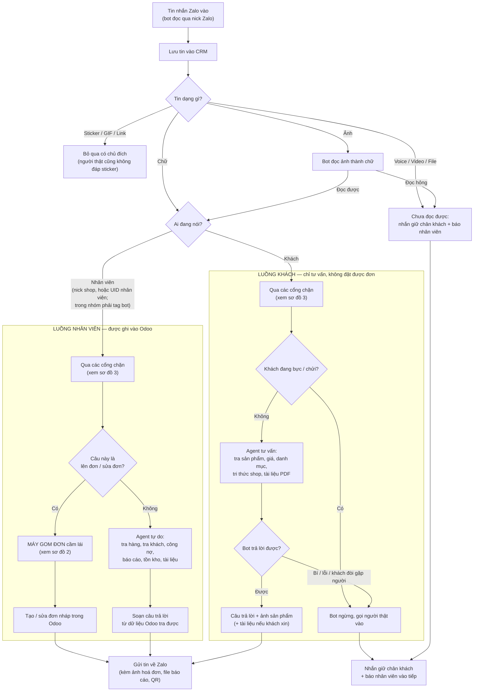
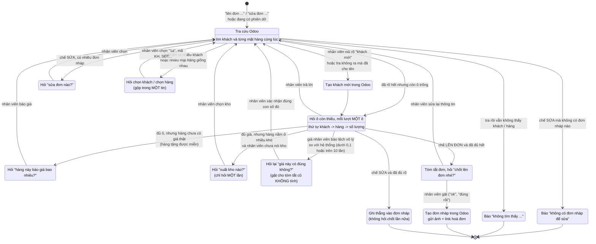

# Sơ đồ luồng bot Zalo

> **Sơ đồ này VIẾT TAY, không tự sinh từ code.** Sửa luồng xử lý thì phải sửa
> sơ đồ kèm trong cùng commit — sơ đồ lạc hậu còn hại hơn không có sơ đồ.
> **Cập nhật lần cuối: 11/08/2026.**

Viết cho người vận hành đọc: mọi thứ trong sơ đồ là ngôn ngữ nghiệp vụ, không
phải tên file. Tên file chỉ nằm ở chú thích cuối mỗi sơ đồ, để lập trình viên
lần ra chỗ sửa. Chi tiết kỹ thuật + lịch sử bug: `docs/KIEN-TRUC-AGENT.md`.

---

## Sơ đồ 1 — Tổng quan: tin nhắn đi đâu, ai xử, trả lời thế nào

Đọc từ trên xuống. Một tin Zalo vào, hệ thống lưu lại rồi hỏi ba câu theo thứ tự:

1. **Đây là chữ hay là ảnh/file?** Ảnh thì bot đọc ảnh thành chữ rồi quay lại
   đầu hàng như một tin chữ bình thường — nhờ vậy ảnh dùng được đủ nghiệp vụ
   (lên đơn, tra khách, tra giá) mà không phải làm riêng một đường.
2. **Nhân viên ra lệnh hay khách hỏi?** Nhân viên có quyền ghi vào Odoo;
   khách thì không (trừ khi bật riêng công tắc cho khách tự chốt).
3. **Việc này là lên đơn/sửa đơn, hay là việc tự do?** Lên đơn thì máy gom đơn
   cầm lái (sơ đồ 2); còn lại thì agent tự tra Odoo mà trả lời.

Đầu ra cuối cùng luôn là một trong ba: **gửi tin về Zalo**, **ghi vào Odoo**,
hoặc **gọi người thật vào**.

**Chú thích cho lập trình viên:** điểm vào `chat/message-handler.ts` ·
phân loại ảnh/file `noi-zalo/luong-media.ts` + `doc-anh.ts` · luồng nhân viên
`noi-zalo/luong-nhan-vien.ts` → `staff-agent.ts` (22 tool) · luồng khách
`noi-zalo/luong-khach.ts` → `customer-agent.ts` (8 tool) · máy gom đơn
`noi-zalo/gom-don/index.ts` · gửi ra Zalo `noi-zalo/gui-zalo.ts` · gọi người
`noi-zalo/bao-nhan-vien.ts`. Ngoài ra: khi nick bot vừa được thêm vào một nhóm
mới, `noi-zalo/chao-nhom.ts` đọc 30 tin gần nhất rồi chào **đúng một lần cho
mỗi nhóm, vĩnh viễn** — đây là đường riêng, không đi qua sơ đồ trên.

---

## Sơ đồ 2 — Máy gom đơn: bot hỏi gì tiếp theo

Khi nhân viên nói "lên đơn cho anh A 5 cái B" hoặc "sửa đơn", **code** quyết
định hỏi gì tiếp — không phải model tự nghĩ. Model chỉ làm một việc: bóc thông
tin trong câu ra thành ô (khách nào, hàng gì, mấy cái, giá bao nhiêu).

Mỗi lượt tin, máy nhìn phiên đang gom rồi chọn **đúng một** việc để làm, theo
thứ tự ưu tiên cố định: tra cứu trước → báo không thấy → hỏi chọn khi nhập
nhằng → hỏi phần còn thiếu → kiểm giá/kho → cuối cùng mới chốt đơn.

Phiên sống 15 phút; hết giờ thì bỏ, nhân viên nói lại từ đầu.

**Chú thích cho lập trình viên:** bảng trạng thái ở
`noi-zalo/gom-don/buoc-tiep-theo.ts` (hàm thuần, 13 loại hành động khai trong
`kieu.ts`); orchestrator `gom-don/index.ts`; phiên lưu bảng `phien_gom_don`
TTL 15'; ngưỡng giá lệch đo từ prod ở `gom-don/gia-bat-thuong.ts`.

---

## Sơ đồ 3 — Các cổng chặn: hàng rào nào chặn cái gì

Đây là những hàng rào bot phải chui qua trước và sau khi trả lời. Mỗi cái sinh
ra từ một sự cố thật, không phải phòng xa. Chia ba nhóm theo thời điểm chặn:
**trước khi tốn tiền** (chặn sớm cho rẻ), **khi đang ghi vào Odoo** (chặn để
khỏi hỏng dữ liệu), và **sau khi model soạn xong câu** (chặn bot nói dối).

**Chú thích cho lập trình viên:** cổng nhận lệnh `agent/staff-command.ts` +
`luong-nhan-vien.ts:dangChoTraLoiNv` · khoá việc Redis `noi-zalo/khoa-viec.ts`
(100 giây, băm theo nội dung) · trần tin `noi-zalo/gioi-han.ts` · ngân sách
thời gian `noi-zalo/dung.ts:hanGioLuot` + `noi-zalo/ngan-sach.ts` · phanh xoá /
phanh 20 bản ghi / cột cấm `odoo/tong-quat/an-toan.ts` (áp cho 3 tool Odoo tổng
quát: đọc, khám phá, làm) · giá bất thường `gom-don/gia-bat-thuong.ts` · trần
tiền khách `noi-zalo/cong-tac.ts:tranTienKhach` · bốn hàng rào chống hứa lèo
`agent/y-dinh-dung.ts` (`khoeDaGhi`, `khoeDaGuiAnh`, `khoeDaGuiTaiLieu`,
`khoeDaChuyenSale`).
